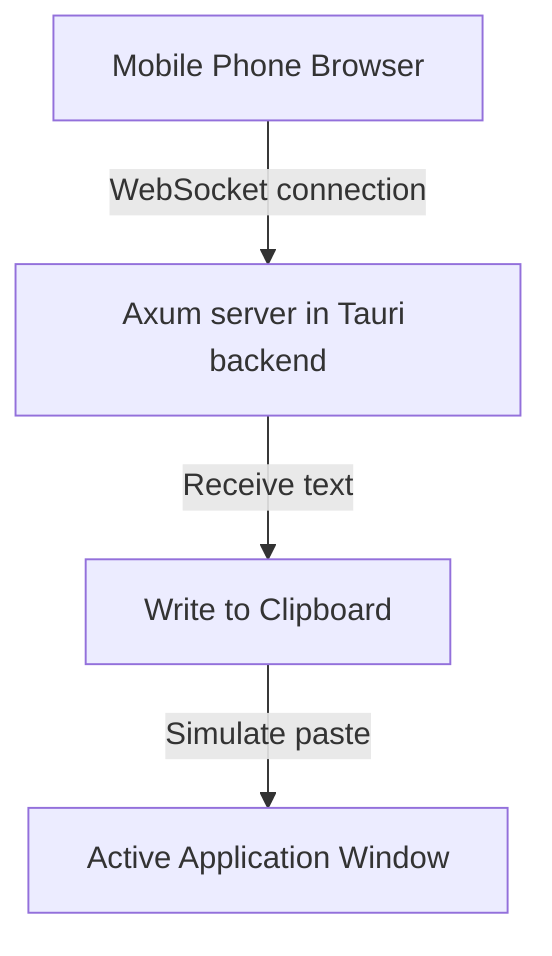

# TypeLink Architecture

TypeLink allows a desktop computer to use a mobile phone as a voice input source.

## Overview

1. **Desktop App**: A Tauri application written in Rust. It serves static HTML pages and exposes a WebSocket server on port `9527`.
2. **Mobile Client**: The phone scans a QR code generated by the desktop app and opens a web page hosted on the desktop's local IP address.
3. **Voice Input Flow**:
   - The user opens the input field on the phone and uses voice input (e.g. keyboard voice typing).
   - As the user speaks or submits, the phone sends the text payload via WebSocket.
   - The desktop app receives the payload, writes it to the clipboard, and simulates a paste command (`Cmd+V` or `Ctrl+V`).

## Component Details

### 1. Frontend (public/)
Located in [desktop/public](file:///Users/zhangjian/typethin/desktop/public):
- **[index.html](file:///Users/zhangjian/typethin/desktop/public/index.html)**: The phone client page. Establishes a WebSocket connection to the desktop server. Auto-sends textarea updates with a debounce timer of 300ms.
- **[qr.html](file:///Users/zhangjian/typethin/desktop/public/qr.html)**: The desktop window page. Requests `/api/qr` to fetch the local server IP and displays the QR code.

### 2. Backend (src-tauri/)
Written in Rust with the Tauri v2 framework:
- **Axum Web Server**: Runs in a background Tokio task, serving `/`, `/qr.html`, `/index.html`, and `/api/qr`.
- **Keyboard paste simulation**: Pastes the clipboard contents.
- **macOS main-thread dispatcher**: Since keyboard simulation queries system keyboard layout configuration, it must be run on the macOS main queue to avoid thread-safety assertions. Dispatched via `app_handle.run_on_main_thread`.
- **Dynamic Tray Icon**: Dynamically generates a 16x16 pixel representation of "TL" in Rust and sets it as the system tray icon, updating the color dynamically to gray (disconnected) or green (connected).
- **Windows Network Adapter Name Resolution**: Resolves adapter GUIDs returned by `if_addrs` to human-friendly names (e.g. `WLAN`, `以太网`) on Windows by querying the registry (`HKEY_LOCAL_MACHINE\SYSTEM\CurrentControlSet\Control\Network\{4D36E972-E325-11CE-BFC1-08002BE10318}\<GUID>\Connection`). This enables correct sorting and classification of wireless, wired, virtual, and VPN network interfaces.

